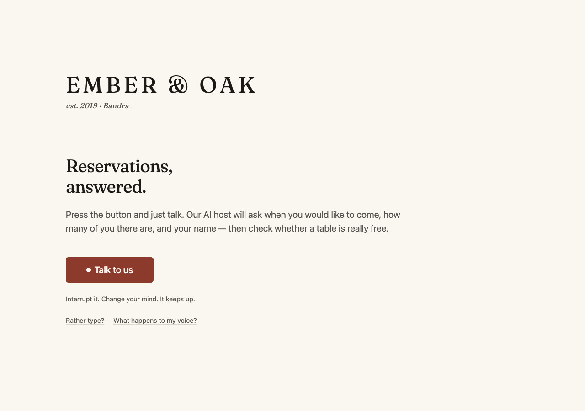
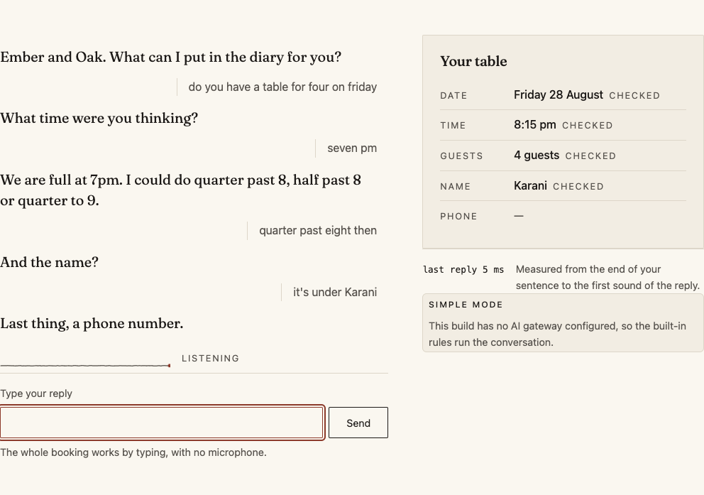
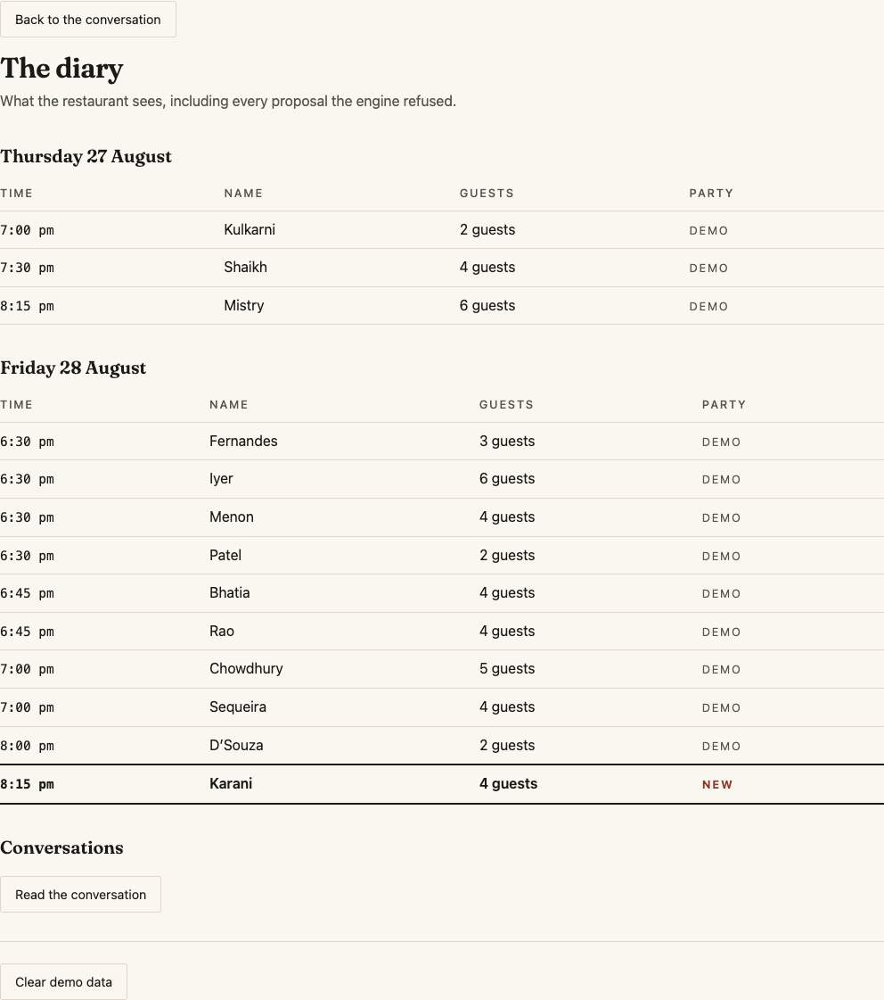
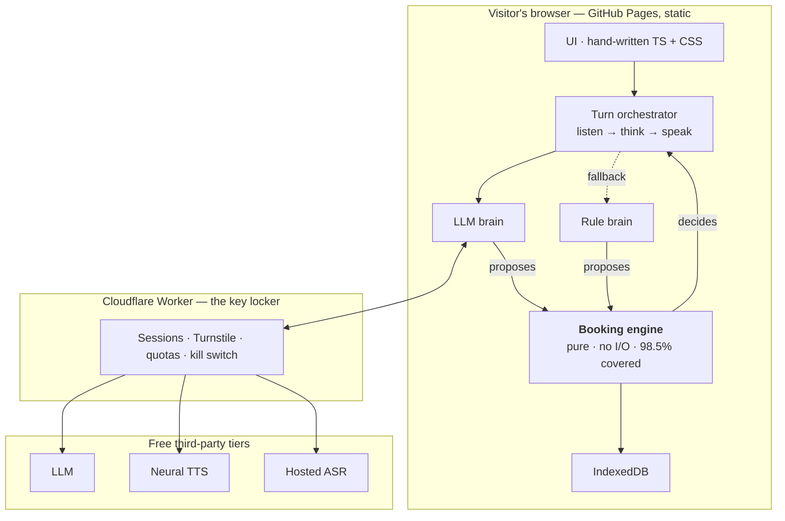

# Hostline

**Talk to an AI restaurant receptionist and book a table — in your browser, in one click.**

[**Try it →** https://parshvak26.github.io/hostline/](https://parshvak26.github.io/hostline/)

No signup. No app. No API key. It works in your browser, and it costs nobody anything.

---

## What it does

- **Press one button and talk.** It asks when you'd like to come, how many of you there are, and your name — then checks whether a table is really free and books it.
- **Interrupt it.** Talk over the agent and it stops mid-word and adjusts.
- **Change your mind.** "Actually, make it five" updates the booking and re-checks availability before anything is written.

---

## Limitations

*This section is deliberately first. It keeps the rest of the page honest.*

- **This is a portfolio project, not production software.** One fictional restaurant, no real bookings, nothing you enter reaches anyone.
- **English only**, in two locales (`en-IN` and `en-US`).
- **One restaurant.** Multi-restaurant support is a directory instead of a file, and is not built.
- **No cancel or modify by voice.** You can make a booking; you cannot change one by talking to it.
- **Browser speech recognition varies a lot.** Chrome and Edge are good. Firefox has none of its own and needs the hosted path. iOS Safari's is unreliable enough that iOS is routed to the hosted path by default. Where neither is available, you type — and the whole booking completes by typing.
- **Barge-in is imperfect in a noisy room.** It is energy-based, not a model: it hears *loud*, not *speech*. A trained voice-activity model would cost several hundred KB of WASM that the 2MB budget does not have. This is a real trade and [`docs/degradation.md`](docs/degradation.md) says so.
- **Muting recognition during playback is gating, not echo cancellation.** The browser's `echoCancellation` does the acoustic half; the gate simply refuses to believe anything heard while the agent is talking.
- **The rule brain's parsers are heuristics.** They handle the fixture corpus and a good deal besides, and they will occasionally misread a sentence. The read-back is what catches that.
- **The free tiers rate-limit.** When one is exhausted the demo drops to simple mode. That is a designed state, not a failure.
- **Safari and iOS are untested.** Playwright's pinned WebKit build does not run on this machine's macOS version, so the end-to-end suite has only been exercised on Chromium (green) and Firefox (partial, blocked by an environmental `AudioContext` hang). The code paths for them exist; nobody has watched them work.
- **Some numbers below are unmeasured**, and are marked as such. Nothing here is published as an achievement until a real run produced it.



Mid-conversation — the transcript on the left, the booking assembling itself on
the right, one detail at a time:



And the restaurant's own view afterwards, with the new booking marked by a rule
and the word "new" rather than by a colour:



*These are screenshots of the real built site, regenerated by
`npm run screenshots`, which fails if the page logs an error while being
photographed.*

---

## Why it exists

Small restaurants take most of their bookings by phone, and the phone rings hardest exactly when nobody is free to answer it. The commercial fixes charge by the diner or by the minute, and you cannot inspect them.

Hostline is the other version: open, free, and built so that the parts that have to be right — the date, the time, the table — are checked by ordinary code rather than generated and hoped for.

---

## The idea worth stealing: two brains

There are two things thinking, and only one of them is allowed to be wrong.

```
        AI brain — understands people, sounds human
                    │  proposes
     ═══════════════╪═══════════════  the boundary
                    │  checks · decides · writes
        Booking engine — plain code, no AI, no I/O
```

The model handles understanding "half seven, four of us, maybe five" and phrasing a reply. It is good at that. It is not reliably right about anything, so it is never asked to be.

A dependency-free TypeScript engine owns every fact: it validates each detail independently, computes real table availability against actual inventory and turn times, and is **the only component permitted to write a booking**.

**This is enforced by structure, not by asking the model nicely.** The clearest expression of it is the `commit_booking` tool, which takes **no arguments at all**:

```ts
{ name: 'commit_booking', parameters: { type: 'object', properties: {}, additionalProperties: false } }
```

There is nowhere for the model to put a booking. It can *ask*; the engine re-derives every precondition from its own state — are all five details validated, was a read-back genuinely offered, did **the visitor's own words** classify as agreement, is the table still free — and refuses if any of them fails.

**The evidence:** [`tests/unit/adversarial.test.ts`](tests/unit/adversarial.test.ts) — 26 tests covering all fourteen adversarial cases, each constructing a tool call exactly as a model would emit it and asserting both the typed rejection *and* that no booking exists afterwards. It is a release gate.

Try breaking it yourself: delete the `lastAffirmation !== 'yes'` check in `src/engine/machine.ts` and re-run. Five tests go red immediately.

Full detail: [`docs/ai-boundary.md`](docs/ai-boundary.md).

---

## What happens when the free AI runs out

It gets slightly less chatty and carries on booking tables.

The same engine that validates the model's proposals can run the entire conversation by itself. When the free tier is exhausted, the gateway is unreachable, or the owner flips the kill switch, the rule brain takes over mid-conversation and the visitor sees a small `simple mode` tag. No error, no dead page.

Five rungs, each a complete experience rather than a broken version of the one above:

| When this fails | This happens instead |
|---|---|
| Free AI limit reached, or the model is slow | The rule brain finishes the turn |
| The neural voice is unavailable | The browser's own voice speaks the same words |
| The browser cannot recognise speech (Firefox, iOS) | Recognition goes through the gateway |
| The microphone is denied or absent | Typing, with the whole conversation intact |
| Everything external is down | Typed conversation, rule brain — **still books a table** |

That last row is proved by [`tests/e2e/no-gateway.spec.ts`](tests/e2e/no-gateway.spec.ts), which aborts every off-origin request at the network layer — and, in a second case, also deletes the speech-recognition API and `navigator.mediaDevices` — and still completes a booking. It passes on Chromium. Full matrix: [`docs/degradation.md`](docs/degradation.md).

---

## Measured, not claimed

Every number here came from a real run on this machine. Nothing is estimated.

| What | Measured | Target | Conditions |
|---|---|---|---|
| Reply latency, rule brain (p50) | **0.05 ms** | — | Apple M5, 10 cores · Node 24 · 32 conversations, 172 turns |
| Reply latency, rule brain (p95) | **0.09 ms** | <400 ms | same |
| **Reply latency, AI mode** | **not measured** | p50 <1000 ms | Needs a deployed gateway and a provider key. See below. |
| JavaScript bundle | **44.1 KB** gzipped | <120 KB | `npm run build` |
| CSS | **5.0 KB** gzipped | <20 KB | same |
| Fonts | **39.6 KB** | <60 KB | Fraunces, subset to the characters actually used |
| Total first visit | **146.0 KB** gzipped | <2 MB | same, including the social preview image |
| Engine statement coverage | **98.5%** | ≥90% | `npm run test:unit` |
| Tests | **1,411** | — | 1,259 unit/integration + 124 gateway worker + 28 end-to-end (Chromium) |
| axe-core serious/critical | **0** | 0 | All four views, Chromium |
| Lighthouse | **not measured** | 90+/95+ | Needs a deployed site. |

The rule-brain figure measures the engine end to end — parse, validate, check availability, choose the next line — and **excludes** speech synthesis and playback, which are browser-side and measured by the on-screen readout. It is fast because it does no I/O at all; that is the point of the design, not a benchmark trick.

**The AI-mode number does not exist yet**, because there is no deployed gateway and no provider key. Rather than estimate it, it is left empty. Run `npm run measure-latency` after deploying to fill it in. Detail: [`docs/latency.md`](docs/latency.md).

---

## How the speed is bought

Two mechanisms, both in [`docs/latency.md`](docs/latency.md):

1. **Prebaked audio.** The agent's fixed lines — 34 of them — are synthesised once at build time and served as Opus from the same origin. A turn served from the cache costs **0 ms of synthesis**, which is most of a one-second budget saved on sentences the agent says in every conversation.
2. **A prebaked filler at 400 ms**, so the visitor's sense of how long they waited is anchored to "let me check" rather than to silence — and `onFirstToken` cancels it the moment a fast model reply starts, so a quick answer never gets a filler bolted onto the front.

Plan §12.5 also expects sentence-level overlap — speaking the model's first sentence while it writes the second. That machinery is written and tested but **deliberately not on the critical path**, because the engine emits the line for nearly every turn and the engine's line wins; streaming the model's prose would speak something then superseded. [`docs/latency.md`](docs/latency.md) explains the trade rather than claiming the mechanism twice.

---

## Architecture



Everything the visitor's booking depends on happens on their own device. The worker exists for exactly one reason — an API key cannot live in a web page — and once you have somewhere to put a key, it is also the only place a spending limit can be enforced.

Detail: [`docs/architecture.md`](docs/architecture.md).

---

## Tech stack

| Choice | Why | What was rejected, and why |
|---|---|---|
| TypeScript, **no framework** | One page, nine components, and the visual identity is a stated requirement | React/Vue/Svelte add 40–120 KB *and* a recognisable default look. [ADR-0001](docs/decisions/0001-no-ui-framework.md) |
| **Hand-written CSS** | A framework's defaults are exactly what "generated" looks like | Tailwind's output is legible as Tailwind at a glance |
| **Pure TS engine, zero dependencies** | Enables exhaustive testing and the safety boundary | Doing this inside UI code makes it untestable and lets the boundary erode |
| **Cloudflare Workers** | Free, no cold start, and secrets have to live somewhere | Container hosts: 20–50 s wake-up, fatal for a demo |
| **Web Speech API** | Free, streaming, zero download, gives interim results | Whisper in WASM is 40 MB+ and breaks the budget |
| **Prebaked audio cache** | The mechanism that makes sub-second reachable | Synthesising every line is slower and burns the free tier faster |
| **IndexedDB** | Survives refresh, no server, no privacy exposure | A hosted database is a cost and a liability |
| Vitest + Playwright + axe-core | Engine correctness, real browser flows, accessibility | — |

Also deliberately rejected: any state-management library, any WASM runtime, any bundled model weights, any database, any auth provider, any analytics, any error-tracking SaaS, a custom domain. **The browser bundle has zero runtime dependencies.**

---

## Running it yourself

**It runs with no key, no account and no cost.** In that state it uses the rule brain and the browser's own voice, and it books tables.

```bash
git clone https://github.com/parshvak26/hostline.git
cd hostline
npm ci
npm run dev
```

Book a table from the terminal, with no browser at all:

```bash
npm run converse           # interactive
npm run converse -- --demo # a scripted conversation
```

Setting up your own gateway is **optional** and covered separately in [`docs/self-hosting.md`](docs/self-hosting.md). If you own this repository, [`RUNBOOK.md`](RUNBOOK.md) is the plain-English version.

---

## Testing

```bash
npm test                                      # everything
npm run test:unit                             # with the coverage gate
npm run test:worker                           # the gateway, under Miniflare
npm run test:e2e                              # real browsers
npm run lint                                  # includes the design-rule grep
npx vitest run tests/unit/adversarial.test.ts # the safety gate
```

If the browser tests all time out on the Talk button, the cause is usually a
wedged macOS audio service rather than the code: `new AudioContext()` stops
responding, and every spec that starts a conversation waits on it.
`sudo killall coreaudiod`, or a reboot, clears it.

The engine coverage gate is **90% statements** and fails the build below it; it currently sits at 98.5%. The fixture corpus is 113 labelled utterances and 32 full conversations, and it is append-only: every misunderstanding becomes a new fixture in the same commit as its fix.

---

## What leaves your device

**Stays here:** your booking, the transcript, and every decision about tables and availability. Bookings live in your own browser's storage and are never uploaded. There is no database and no server-side store of any kind.

**Leaves here, when the AI is switched on:** what you said, as text, goes to the model provider through the gateway; the reply text goes to the voice provider to be spoken. Where the browser cannot recognise speech itself, the audio goes through the gateway to a recognition service.

**A browser detail worth knowing:** in Chrome, speech recognition is performed by the browser, which sends audio to Google. That is a property of the browser, not of this project, and the page says so before the first microphone use.

**In simple mode nothing leaves your device at all.**

No accounts, no logins, no cookies, no tracking, no analytics. A visible "Clear demo data" control wipes everything.

---

## Cost

| Line item | Service | Cost |
|---|---|---|
| Source and CI | GitHub, public repository | $0 |
| Web hosting | GitHub Pages | $0 |
| Edge service | Cloudflare Workers, free plan | $0 |
| Bot protection | Cloudflare Turnstile | $0 |
| AI brain, voice, recognition | Free tiers, hard-capped | $0 |
| Database | None — the visitor's own browser | $0 |
| Fonts, monitoring, analytics, domain | Self-hosted / none / none / `github.io` | $0 |

**Cost is structurally zero, and not because the counters are accurate.** No paid plan exists on any account used by this project. When a free tier is exhausted the provider returns an error, the client falls back, and the demo carries on. The quota controls exist to keep the free tier available for real visitors; they are not what stops a bill, because there is no bill to stop. This is explained honestly in [`docs/degradation.md`](docs/degradation.md).

---

## Roadmap

Not built, and clearly labelled as such:

- Cancel and modify by voice — the data model supports it; only the dialogue flows are missing
- Answering questions: hours, address, parking
- Waitlist capture when a slot is full
- A published measurement of the AI brain against the rule engine on the same corpus
- Hindi, then other languages

---

## Documentation

| Document | What it covers |
|---|---|
| [`docs/architecture.md`](docs/architecture.md) | The layers, the boundaries, and one turn end to end |
| [`docs/ai-boundary.md`](docs/ai-boundary.md) | How the model is prevented from committing a booking, and what that does not cover |
| [`docs/degradation.md`](docs/degradation.md) | Every failure and its defined behaviour; why cost is structurally zero |
| [`docs/latency.md`](docs/latency.md) | Where the milliseconds go, and what has actually been measured |
| [`docs/self-hosting.md`](docs/self-hosting.md) | Deploy your own gateway with your own keys |
| [`docs/decisions/`](docs/decisions/) | Short ADRs, one decision each |
| [`RUNBOOK.md`](RUNBOOK.md) | Plain-English operating instructions |

---

## Licence

MIT. See [`LICENSE`](LICENSE).

*Ember & Oak is a fictional restaurant. Every booking in the diary is synthetic, and no real person's name or phone number appears anywhere in this repository.*
