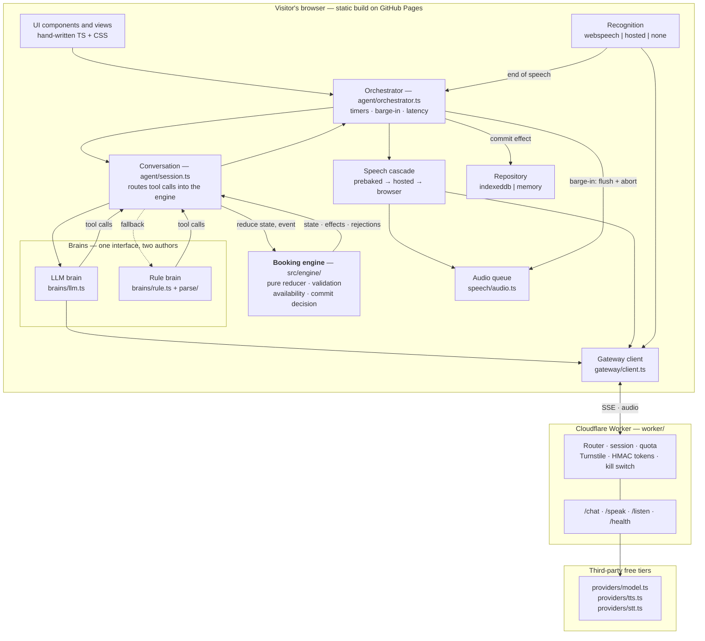

# Architecture

Hostline is a voice booking agent that runs entirely in a browser tab. It has
**two brains and one boundary**: a language model that understands people and
sounds human, and a pure-TypeScript booking engine that decides what is true.
The model proposes; only the engine commits. Between the page and the model sits
a Cloudflare Worker that holds the secrets and enforces the daily spend. Around
all of it are **five places the system can fall back**, listed in one place in
[`src/main.ts`](../src/main.ts): gateway or no gateway, model or rule brain,
baked clip or neural voice or `speechSynthesis`, browser recognition or hosted
recognition or typing, IndexedDB or memory. Every one of those has a working
right-hand side, so a build with no gateway, opened in a browser with no
microphone and no persistent storage, still books a table by typing.

## The shape of it



Two arrows differ from the diagram in the plan, and both matter. The brains do
not talk to the engine directly — [`agent/session.ts`](../src/agent/session.ts)
sits between them, so there is exactly one function in the codebase that feeds a
tool call to `reduce`. And the engine does not write to storage; it emits a
`commit` effect carrying a finished `Booking`, and the orchestrator hands that to
the repository.

## The layers, and what each may not do

The right-hand column is the interesting one.

| Layer | Owns | Must not |
|---|---|---|
| **Booking engine** — [`src/engine/`](../src/engine/) | The dialogue state machine, per-field validation, availability and alternatives, the read-back, the commit decision, the outcome | Touch the DOM, network, storage, `Date`, `Math.random`, `setTimeout` or `console`; import anything outside its own directory |
| **Orchestrator** — [`agent/orchestrator.ts`](../src/agent/orchestrator.ts) | *When* things happen: brain selection, the filler timer, the brain deadline, barge-in, latency marks, transcript persistence | Contain a booking rule. If a change here alters whether a table can be booked, it is in the wrong file |
| **Conversation** — [`agent/session.ts`](../src/agent/session.ts) | *What* happens in a turn: raw words to the engine first, brain calls into `reduce`, choosing which lines are spoken | Own audio, timers or a browser. It is the same object the fixture harness and `scripts/converse.ts` drive |
| **The two brains** — [`brains/llm.ts`](../src/agent/brains/llm.ts), [`brains/rule.ts`](../src/agent/brains/rule.ts) | Turning a sentence into tool calls and, optionally, a suggested reply | Decide availability, write a booking, or repair their own tool arguments — malformed ones are forwarded verbatim |
| **Speech adapters** — [`speech/asr/`](../src/speech/asr/), [`speech/tts/`](../src/speech/tts/) | Transcripts and end-of-speech; resolving text to audio through prebaked → hosted → browser | Know anything about booking. A failed rung is skipped for the session, never retried |
| **Audio queue** — [`speech/audio.ts`](../src/speech/audio.ts) | Sample-accurate playback of small chunks against the Web Audio clock; synchronous `flush()` | Fetch anything, or `await` on the flush path |
| **Repository** — [`src/storage/`](../src/storage/) | Persisting bookings and transcripts; seeding the demo diary once | Validate anything, or read a clock — `today` arrives as an argument |
| **Gateway client** — [`gateway/client.ts`](../src/gateway/client.ts) | Sessions, SSE reassembly, aborts, and mapping every HTTP status to a degradation | Surface an error to the visitor. Every failure becomes "use the rule brain and the browser's voice" |
| **Gateway worker** — [`worker/`](../worker/) | Secrets, Turnstile, HMAC session tokens, quotas, the kill switch, streaming proxies | Store or log conversation content. Nothing about a turn survives the request |

## Trust boundaries

```
  Visitor      ──[untrusted]──▶  Browser app
  Browser app  ──[untrusted]──▶  Gateway        ← the only place a secret exists
  Gateway      ──[authenticated]──▶  Providers
  Model output ──[UNTRUSTED]──▶  Booking engine ← the one that matters
```

Two of these are enforced rather than assumed.

**The gateway trusts nothing from the browser.** Session tokens are HMAC-SHA256
over four claims, signed and verified in
[`worker/src/session.ts`](../worker/src/session.ts); the quota inside the token
is a display convenience and the server re-checks the same limits on every
request. The system prompt is built in
[`worker/src/chat.ts`](../worker/src/chat.ts) and a `system` message in the
request body is dropped, not merged — otherwise a visitor could rewrite the
agent's instructions. The tool list the browser sends is ignored; the worker uses
the shared schema from [`brains/tools.ts`](../src/agent/brains/tools.ts).

**Model output is untrusted input.** `ToolCall` is deliberately typed as
`{ name: string; arguments: unknown }`, because a model emits whatever it likes.
`commit_booking` takes no arguments at all, so a hallucinated booking has nowhere
to live, and [`engine/machine.ts`](../src/engine/machine.ts) re-derives every
precondition from its own state — including whether the visitor agreed, which it
classifies from their raw words in
[`engine/confirm.ts`](../src/engine/confirm.ts) rather than believing a brain
that says they did. [`ai-boundary.md`](ai-boundary.md) covers this properly,
including what it does not protect against.

## One turn, end to end

1. **End of speech.** `createSpeechInput` ([`asr/index.ts`](../src/speech/asr/index.ts))
   wraps the Web Speech adapter with `createEndpointer`. Interim results stream
   to the UI; 600ms of silence after the last one — or a final result, whichever
   comes first — fires `onEndOfSpeech` exactly once. That instant is **t0**, and
   every published latency number is measured from it.
2. **Turn setup.** `Orchestrator.handleTurn` records `performance.now()`, aborts
   the previous turn's `AbortController`, mutes recognition so the agent's own
   voice cannot arrive as a visitor turn, and arms a 400ms timer that plays a
   prebaked filler rather than leaving dead air.
3. **The engine sees the words first.** `Conversation.submitWith` calls
   `reduce(state, { type: 'visitor_turn', text }, deps)`, which runs
   `isAbandonment` and `classifyAffirmation` on the raw utterance.
4. **The brain answers.** `createLlmBrain(...).respond` streams
   `GatewayClient.chat` — SSE reassembled by `parseSse` across chunk boundaries —
   accumulating `token` events into a reply and `tool_call` events into a list.
   If the model times out at 2.5s, `finishWithRuleBrain` hands the *same*
   `Conversation` to the rule brain, which parses with `parseDate`, `parseTime`,
   `parseParty`, `parseName` and `parsePhone`. The turn continues; it does not
   restart.
5. **The engine decides.** Each call becomes
   `reduce(state, { type: 'tool_call', call }, deps)`. `proposeSlots` validates
   every field independently through [`validate.ts`](../src/engine/validate.ts),
   `checkAvailability` and `findAlternatives`
   ([`availability.ts`](../src/engine/availability.ts)) allocate best-fit tables,
   `requestConfirmation` builds a read-back, and `commitBooking` re-checks the
   lot. Refusals come back as typed `Rejection`s.
6. **Choosing the words.** `linesFrom` collects the `say` effects;
   `chooseSpokenLines` prefers them over the brain's own wording, so a charming
   sentence that does not ask the question the engine requires is discarded.
   `renderPhrase` turns a `PhraseKey` and its params into text.
7. **Speaking.** `splitSentences` chunks the line, `SpeechCascade.resolve` tries
   prebaked → hosted → browser, and `AudioQueue.enqueue` schedules each chunk
   against the Web Audio clock so the joins are sample-accurate.
   `markFirstAudio` records t0 → first audible sample and emits it to the
   on-screen readout.
8. **Afterwards.** A `commit` effect is saved via `repository.saveBooking`;
   `persistTranscript` stores the turns, including every proposal the engine
   refused. Barge-in at any point runs `Orchestrator.interrupt()`: flush the
   audio, cancel the speech request, abort the in-flight turn — in that order,
   because stopping only the sound is how an agent resumes a sentence nobody is
   listening to.

## Why the engine is pure

`src/engine/` has no I/O, no ambient clock, no randomness, and no imports from
outside itself. Time and identifiers arrive through `EngineDeps`, built once in
[`agent/clock.ts`](../src/agent/clock.ts).

That purity is enforced by tooling. [`eslint.config.js`](../eslint.config.js)
carries `no-restricted-globals`, `no-restricted-properties` and
`no-restricted-syntax` blocks scoped to `src/engine/**`, including a rule that
permits only same-directory relative imports. And the rules themselves are
tested: [`tests/unit/lint-rules.test.ts`](../tests/unit/lint-rules.test.ts) feeds
a deliberately impure fixture through ESLint and asserts each violation is caught
by message. A rule nobody has watched fail is a rule nobody should believe in.

What it buys is exhaustive testing — every transition, every boundary, every
adversarial tool call asserted without a browser, a network or a mocked clock.
`npx vitest run` passed 1249 tests across 28 files on 25 August 2026;
[`vitest.config.ts`](../vitest.config.ts) gates engine coverage at 90% statements
and 85% branches. It also keeps the portability argument honest: the engine and
[`agent/ports.ts`](../src/agent/ports.ts) contain no assumption that a browser
exists, so a telephony front end could reuse the engine unchanged.

## Notable structural decisions

- No UI framework and no CSS framework, because a default look is the thing the
  brief forbids — [ADR-0001](decisions/0001-no-ui-framework.md).
- The engine is TypeScript rather than the originally planned Python, which
  saved roughly 7MB of Pyodide once telephony was dropped —
  [ADR-0002](decisions/0002-engine-in-typescript.md).
- One committed warm light palette, no dark mode, recorded as a choice rather
  than an omission — [ADR-0003](decisions/0003-no-dark-mode.md).
- The seeded diary holds twelve bookings, not the planned four to six, because
  best-fit allocation needs seven tables occupied before the demo's deliberately
  full Friday is genuinely full — [ADR-0004](decisions/0004-seeded-diary-size.md).
- `engine/time.ts` and `agent/session.ts` were added to the planned layout, and
  the reasoning is written down rather than left as drift —
  [ADR-0005](decisions/0005-engine-file-layout.md).
- Groq behind the adapters in `worker/src/providers/`, with the free-tier
  verification explicitly left open and no measured claim made about it —
  [ADR-0006](decisions/0006-provider-selection.md).

## What is deliberately absent

- **No server.** The site is static files on GitHub Pages. The worker is not an
  application server: it holds keys and counts requests, and never sees a
  booking.
- **No database.** Bookings live in IndexedDB behind `BookingRepository`, with an
  in-memory implementation for private browsing. Nothing is uploaded, so there is
  nothing to breach and nothing to pay for.
- **No router.** One page, one route. Sections are revealed by removing `hidden`
  from elements already present in [`index.html`](../index.html).
- **No state-management library.** Engine state is a value returned by `reduce`.
  The UI is a `switch` over `OrchestratorEvent` in `main.ts`, which is smaller
  than the store it would replace.
- **No runtime dependencies.** `package.json` has `devDependencies` only; the
  browser bundle contains no third-party code, and the engine imports nothing at
  all.

Each absence is a decision with a cost accepted deliberately: DOM updates are
written by hand, and the reviewer's reward is that there is nothing between them
and the logic.

## Known gaps between this design and the current code

Two mechanisms exist but are not yet wired, and it is more useful to say so than
to describe them as working:

- **Sentence-level overlap buys less here than the plan assumed.** `main.ts`
  wires `onFirstToken`, so a fast model reply cancels the pending filler rather
  than having "let me check" bolted onto the front of it. But streaming the
  model's *prose* straight to speech is deliberately not wired: in this
  architecture the engine emits the line for nearly every turn and the engine's
  line wins (`chooseSpokenLines`), so speaking the model's tokens as they arrive
  would speak something that is then superseded. The mechanism that actually
  carries the latency budget is the prebaked cache. `createSentenceStream` and
  `hasSentenceBoundary` exist and are tested for the turns where the model's
  wording is the wording spoken.
- `speech/vad.ts` opens its own microphone stream once the conversation starts,
  because Web Speech gives no access to the audio it consumes. Energy-based
  barge-in is wired through `Orchestrator.onMicrophoneEnergy`; the Talk button
  and the `Esc` key remain as the paths that need no microphone at all.
- The session handshake — `gateway/turnstile.ts` → `GatewayClient.ensureSession`,
  on the first press of the Talk button — is written and typechecked but has
  never run against a live gateway, because no gateway has been deployed. Every
  failure path resolves to "no session, rule brain", so the worst case is the
  behaviour the site already has by default.
